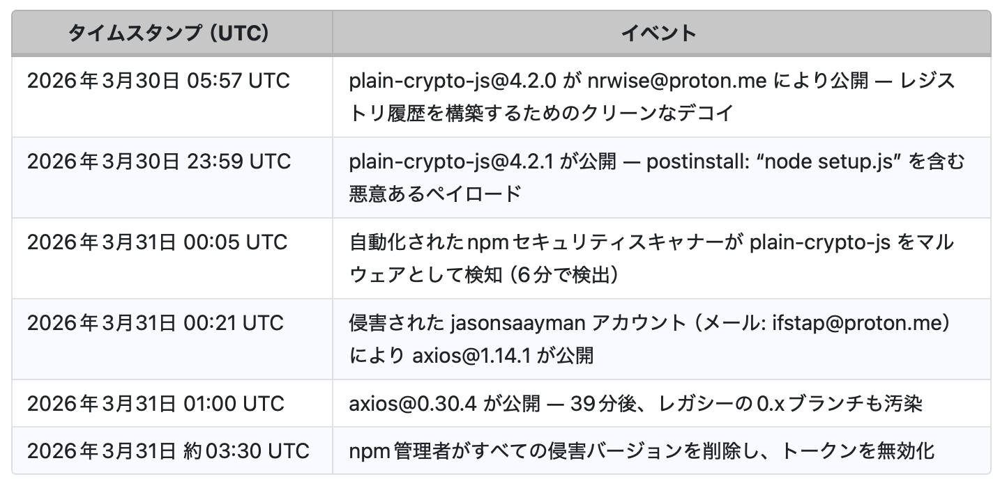

# ゼロデイ攻撃

ソフトウェアの脆弱性が発見された後、開発者やベンダーがその修正プログラム（パッチ）を公開・対応する前（＝期間がゼロ日）の時点を指す

## axiosの侵害例の場合[axios侵害例](https://www.trendmicro.com/ja_jp/research/26/d/axios-npm-package-compromised.html)

マルウェア公開準備開始(レジストリ汚染) => 2026/03/30 05:57
plain-ctypto-js@4.2.1がpost install に含まれた => 2026/03/30 23:59
マルウェア感知(自動化されていうnpmスキャナー) => 2026/03/31 00:05
マルウェアを含む(plain-ctypto-js@4.2.1)axios@0.30.4が公開,0.x系も汚染 => 2026/03/31 01:00
パッチ適用 => 2026/03/31 03:30

01:00 ~ 03:00 の間をゼロデイと呼ぶ

## TanStackの場合

## BRICKSTORMマルウェア（UNC5221）

[BRICKSTORMマルウェア検出：UNC5221および関連する中国支援の攻撃者が米国の法律およびテクノロジー分野を標的に](https://socprime.com/blog/brickstorm-backdoor-detection/)

中国関連APT **UNC5221**（Silk Typhoonと関連付けられることもあるが、現在は別グループとして扱われる）が、Go言語製バックドア **BRICKSTORM** を用いて、米国の法律事務所・テクノロジー企業・SaaS企業・BPO企業を標的にしたキャンペーン。2025年3月から継続し、1年以上検知されずにデータ窃取が行われた。

ゼロデイとの関係：少なくとも1件の侵入で **ゼロデイ脆弱性** が悪用された。他の侵入ではフォレンジック対策機能を備えたポストエクスプロイトスクリプトで侵入経路を隠蔽した。

### 全体像

BRICKSTORMはGo言語製のバックドア。Linux/BSD系ネットワークアプライアンス、VMware vCenter、ESXiなどに設置され、長期潜伏・認証情報窃取・横展開・データ窃取を行う。PCではなく仮想化基盤やアプライアンスを狙う点が特徴。

### 攻撃チェーン（段階ごと）

#### 1. 初期侵入

- 少なくとも1件で **ゼロデイ脆弱性** を悪用
- フォレンジック対策機能付きポストエクスプロイトスクリプトで侵入経路を隠蔽

#### 2. アプライアンスへのバックドア設置

- EDRサポートを持たない **Linux/BSDベースのアプライアンス** にBRICKSTORMを設置
- 正規プロセスを模倣するように偽装
- C2は Cloudflare Workers、Heroku、動的DNS（sslip.io、C2nip.io など）を活用。C2nip.ioドメインは被害者間で再利用されず、運用セキュリティを重視

#### 3. VMware vCenter / ESXi への展開

- VMware vCenterおよびESXiホストを一貫して標的
- 盗んだ有効な認証情報でSSH接続し、BRICKSTORMを設置
- 必要に応じてESXiのWeb UIまたはVAMI経由でSSHを有効化
- ある事例では、インシデント対応開始後にvCenterサーバーへBRICKSTORMをインストール

#### 4. 認証情報窃取：BRICKSTEAL

- Apache TomcatのWebインターフェースに悪意あるJavaサーブレットフィルタ **BRICKSTEAL** を設置
- HTTP基本認証のログイン要求を傍受し、認証情報をデコード（高権限ADアカウントが多い）
- カスタムのインメモリドロッパーで設定変更や再起動を回避
- Delinea（旧Thycotic）Secret Serverなどパスワード保管庫へ横展開し、シークレットスティーラーで認証情報を抽出・復号

#### 5. 永続化・横展開

- `init.d`、`rc.local`、`systemd` ファイルを変更し、再起動時にバックドアが自動起動
- 別ケースではJSPウェブシェル **SLAYSTYLE（別名BEEFLUSH）** を展開し、HTTP経由で任意OSコマンドを実行
- 有効な認証情報でVMware環境へ横方向移動
- BRICKSTORMは主要バックドア、他の侵害アプライアンスはバックアップとして利用

#### 6. データ窃取

- BRICKSTORMの **SOCKSプロキシ** で被害者ネットワーク内にトンネル接続
- 盗んだ認証情報で内部コードリポジトリにログインしアーカイブをダウンロード
- UNCパス経由でファイルを直接閲覧
- Microsoft Entra ID Enterprise Applicationsの `mail.read` スコープを利用し、開発者・管理者・中国経済・諜報関連人物のメールを標的（`full_access_as_app`）
- 一部侵入ではBRICKSTORMは後に削除されたが、バックアップのフォレンジック分析で以前の存在が判明

### キーワード整理

| 用語 | 意味 |
|---|---|
| BRICKSTORM | Go言語製バックドア。長期潜伏、C2通信、SOCKSプロキシなどを備える |
| UNC5221 | 中国関連APT。ゼロデイ悪用・ステルス性の高い侵入で知られる |
| BRICKSTEAL | vCenterのTomcatに仕込む認証情報窃取用Javaサーブレットフィルタ |
| SLAYSTYLE（BEEFLUSH） | HTTP経由で任意OSコマンドを実行するJSPウェブシェル |
| SOCKSプロキシ | 攻撃者が被害者ネットワーク内へトンネル接続する仕組み |
| vCenter / ESXi | VMware仮想化基盤。侵害されると多数のサーバーに影響 |
| EDR未対応アプライアンス | 監視が弱く、攻撃者が潜伏しやすい機器 |

### Nezha事例との違い

| | Nezha事例 | BRICKSTORM事例 |
|---|---|---|
| 入口 | phpMyAdmin等のWeb侵入 | ゼロデイ、認証情報悪用 |
| 標的 | Webサーバー | VMware・アプライアンス |
| 手法 | 正規ツール悪用 → Gh0st RAT | バックドア長期潜伏 → 諜報活動 |
| 特徴 | ログポイズニングでWebシェル設置 | SOCKSプロキシで内部トンネル・データ窃取 |

### 防御の観点

- vCenter、ESXi、ネットワークアプライアンスにも監視・ログ収集を入れる
- SSHの有効化・ログイン履歴・設定変更を監視する
- `init.d`、`rc.local`、`systemd` の不審な変更を検知する
- Cloudflare Workers、Heroku、動的DNSへの不審通信を確認する
- パスワード保管庫（Secret Server等）へのアクセス履歴を監査する
- 高権限ADアカウントの利用場所・利用時間を監視する
- vCenterのTomcatやJavaフィルタに不審な追加がないか確認する
