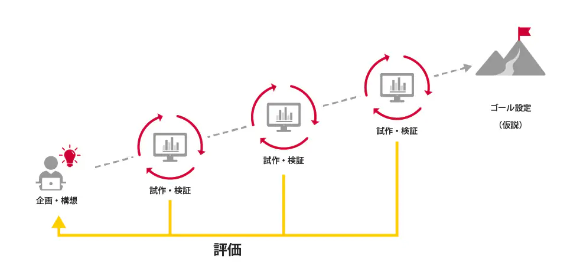

- 参考リンク
    - [PoC（Proof of Concept：概念実証）とは](https://www.ntt.com/bizon/glossary/e-p/poc.html)
    - [PoC / PoV / PoBの違いとは？](https://www.ntt.com/business/services/xmanaged/lp/column/poc-pov.html)

# Pocとは？

- 技術・概念・アイデアの検証を行うための手法の1つ
    - 概念検証、試作開発に入る前段階の検証プロセスの事をPocと呼ぶ
        - Pocで期待通りの検証結果を得た上で実際のプロダクションフェースへ移行する

## Pocの目的、メリット

- なぜ、Pocが必要なのか？
    - Pocを行う事によって卓上議論レベルであった検証が、現実の状況により沿った形で検証する事ができる
        - 不確実な部分をより、広範囲に検証範囲と含める事ができる
            - 数値的な根拠を元に議論を行う事が可能になる

## Poc実行時の注意点

- Pocの目的、Goalをはっきりと明確に決めずにスタートする事で明確な成果が得る事ができずにPocによるコスト等ばかりが増えてしまう状況に陥る事があり得る
    - いわゆる、Poc疲れと呼ばれるものになる可能性がある
        - どうする事が望まれるか？

- Pocとして検証する範囲を明確に定める
    - 検証する範囲
        - Pocによって得たい、結果、必要なデータ
    - 検証する方法
        - 検証する範囲と定めたものを検証できる必要最低限の機能を開発
            - 実際に検証を行い、検証の評価で、PoC実施前には気づかなかった課題を洗い出す
                - 評価をもとにPDCAを回して、サービスや製品の価値の中心をどこに置くのか決めていく事で目的が明確になる

# PoC / PoV / PoBの違い

## Pocの目的

- なぜ、Pocを事前に行うのか？
    - **リスク軽減のた**めであると言える
        - 特に、スタートさせたプロジェクトが理論的に不可だった時に損失が大きくでてしまう
            - そのため、Pocによって実現可能性をはっきりと数値にする事でリスクを回避する事ができる

### PoV（Proof of Value：価値実証）

- Pocでは、明確にならない目的のために臨んだ結果にならない事があり得る
    - そこで、Povという実現可能な事が判定した上でその価値(value)を検証する方法を使う事もある
        - 特に導入する事によってどれだけの効果があるかわからないが、導入した方が良いなどなどの時に必要になる事がある

### PoB（Proof of Business：プルーフオブビジネス）

- 事業検証を行うための検証プロセス
    - PoBのやり方は様々ある
        - 新規サービス、既存事業のリプレイスなどに対してどれだけの効果があるのか？や損益分岐点の検証など
            - 検証方法
                - すべてシステムに抽象化する
                - 一部は人的資源で代替してシステムを活用する方法
                - 特定の人にシステムを公開してフィードバックしてもらう方法

#### 最後に

- PoC・PoV・PoBの違いを整理
    - PoC（Proof of Concept：概念実証）
        - 技術や仕組みが実際に実現可能かどうかを確認するもの
    - PoV（Proof of Value：価値実証）
        - その技術が業務や利用者にとってどのような価値を生み出すのかを検証
    - PoB（Proof of Business：事業実証）
        - 採算性や市場性などを含め、ビジネスとして成立するかどうかを見極める取り組みです。

- PoCは「実現可能性」、PoVは「価値の有無」、PoBは「事業性」という観点で区別され、それぞれ検証するポイントが異なる